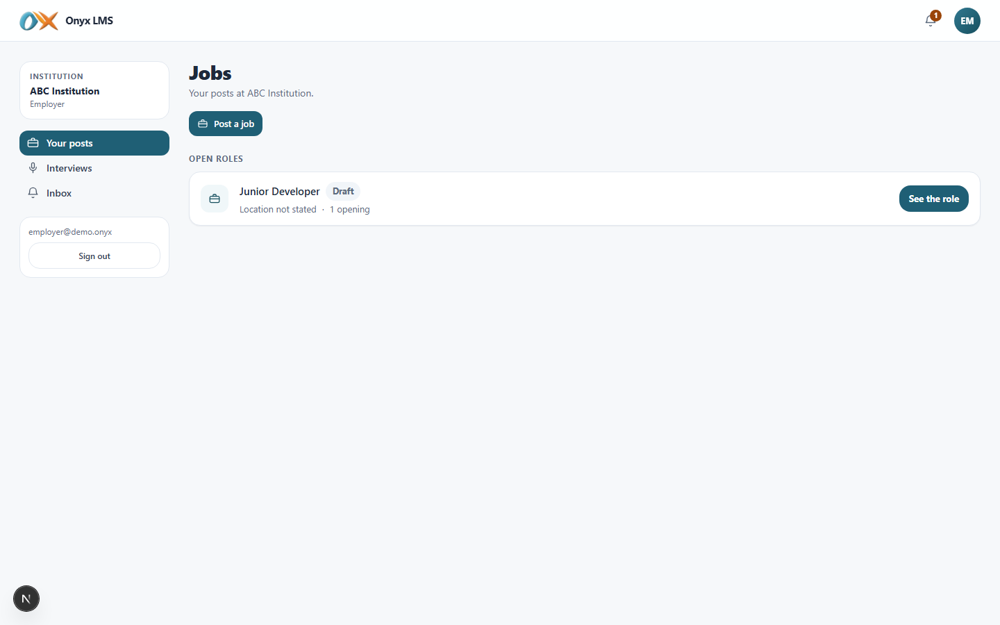
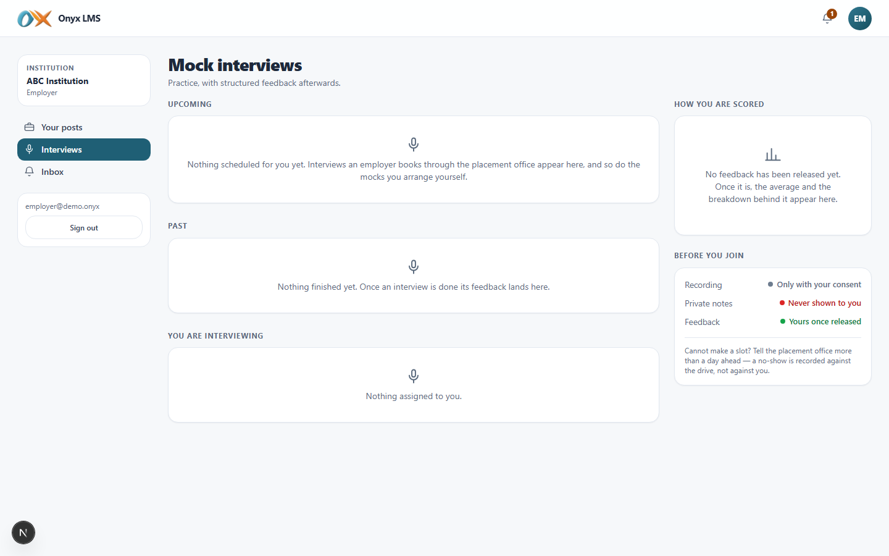
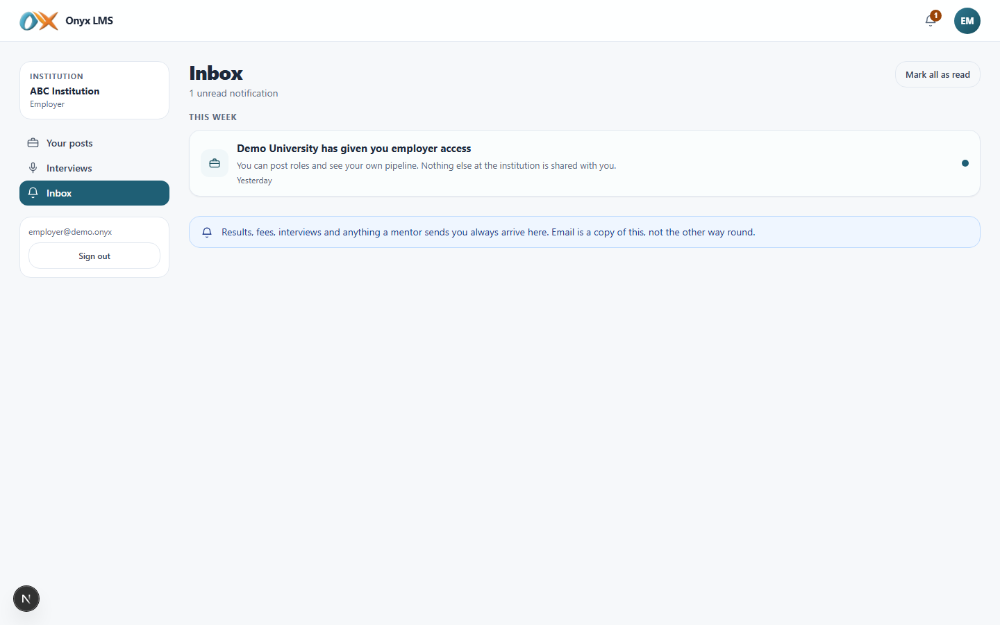

# Employer

DOC-05. What an employer sees and can do in Onyx, screen by screen, with
what each one actually looks like. Screenshots are from the demo
institution (**ABC Institution**), captured live against a running build.

## Who this is

An outsider with an account, not a member of the institution. Sees their
own job posts and the candidates who applied to them, and the interviews
they are conducting — nothing that belongs to the institution itself (no
roster, no other employer's postings, no audit log, no academic data).

## Signing in

| | |
| --- | --- |
| URL | `/onyx/login` |
| Email | `employer@demo.onyx` |
| Password | `Demo#2026!` |
| Institution | ABC Institution |

Signing in lands directly on **Your posts** (`/onyx/jobs`) — the employer
has no dashboard and no need for one.

## Navigation

| Group | Items |
| --- | --- |
| — | Your posts, Interviews, Inbox |

Phone bottom bar: Your posts, Interviews.

---

## Your posts

Only this employer's own postings — a **Post a job** button, and each role
with its status (Draft/Open/Closed) and opening count. Opening a role shows
its own applicant pipeline: an eligibility summary and the candidates who
applied, exactly the pipeline an employer needs and nothing the
institution runs internally.

## Interviews

Interviews this employer is conducting: a join link, and — after — a
structured feedback form (score plus per-criterion comments) that the
placement office then decides when to release to the candidate.

## Inbox

The same one-way, read-only notification centre every role gets — new
applications, interview reminders, and anything else generated for this
account.

---

## What an employer cannot do

Cannot see another employer's postings or candidates, cannot see the
institution's roster, courses, fees, or audit log, and cannot post a job
without the placement office having shared access with them first.
