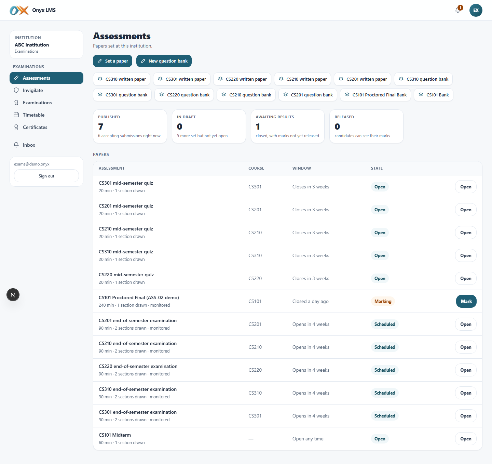
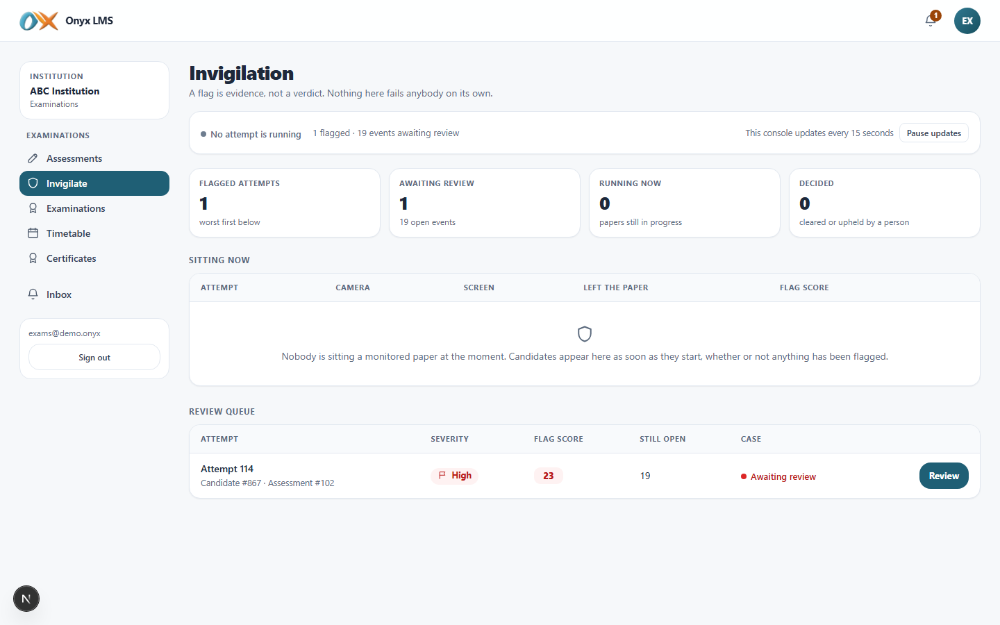
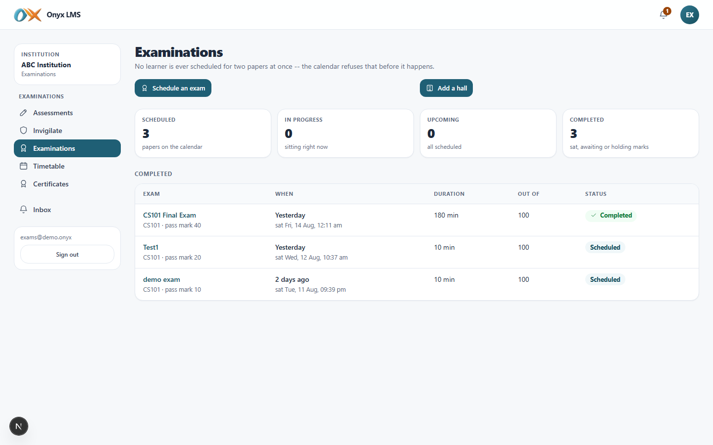
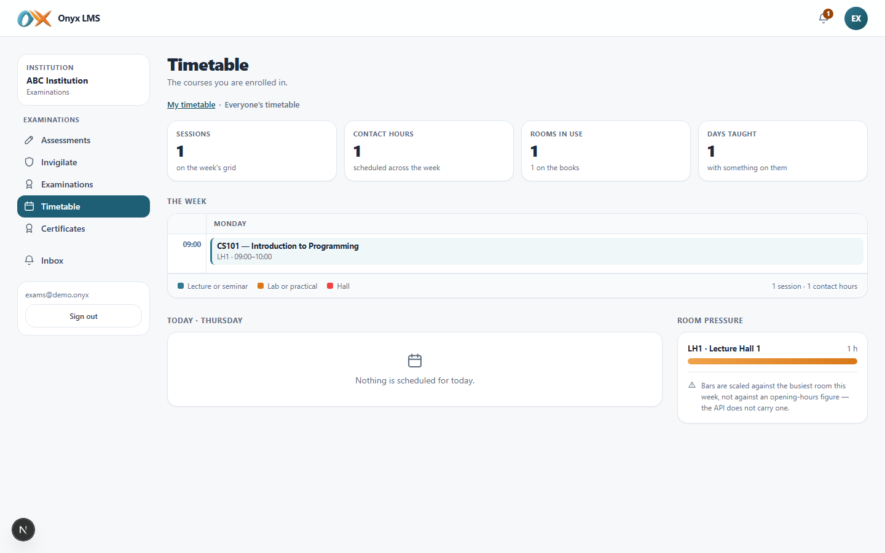
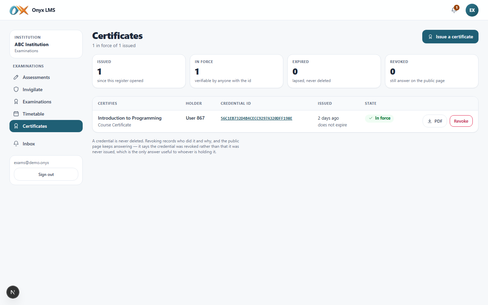
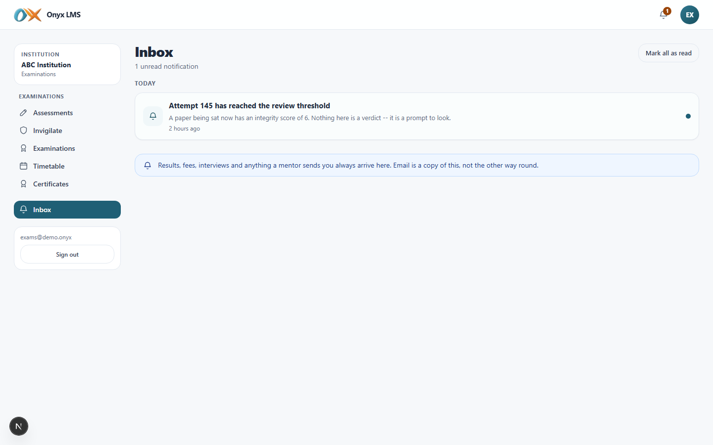

# Examinations office

DOC-05. What the examinations role sees and can do in Onyx, screen by
screen, with what each one actually looks like. Screenshots are from the
demo institution (**ABC Institution**), captured live against a running
build.

## Who this is

Owns the exam calendar institution-wide: scheduling, halls and seating,
moderation, publishing results, invigilation, and transcripts. Does not
teach or take a course — everywhere a course would normally be browsed
(Courses, Practice, Workspaces) is deliberately absent from this role's
menu, because naming a course is always a picker on the screen that needs
it, never something browsed first.

## Signing in

| | |
| --- | --- |
| URL | `/onyx/login` |
| Email | `exams@demo.onyx` |
| Password | `Demo#2026!` |
| Institution | ABC Institution |

There is no dashboard for this role — signing in lands directly on
**Examinations** (`/onyx/exams`), the page this role actually runs. A link
to `/onyx/dashboard` would only have bounced here anyway.

## Navigation

| Group | Items |
| --- | --- |
| Examinations | Assessments, Invigilate, Examinations, Timetable, Certificates |
| — | Inbox |

Phone bottom bar: Examinations, Assessments, Invigilate, Timetable, Inbox.

---

## Assessments

The same staff view faculty get: question banks, building a paper,
marking, and publishing results — but institution-wide rather than scoped
to courses taught, since this role has none of its own.

## Invigilate

The full, unscoped console — every flagged or in-progress attempt across
the whole institution, not one course's worth. Live: who is sitting a
monitored paper right now and their device state (camera, screen, tab
switches), a review queue ordered worst-first by flag severity, and a
distinct section for examinations sat online so a proctored exam's flags
are never lost among ordinary assessments. "A flag is evidence, not a
verdict" is stated on the page itself — nothing here fails anybody
automatically.

## Examinations

The exam calendar and everything CMP-02 promises end to end: **Schedule an
exam** (any course, plus an optional link to an online CBT paper whose
window then locks to the exam's exact slot), **New hall**, and — opening a
scheduled exam — seat allocation, marks entry, **Pull marks from online
paper**, moderation, and **Publish results**. This is the one role that can
do all of it for every course in the institution, not only one.

## Timetable

Read access to the published timetable — where and when everything runs —
without the scheduling controls, which stay with the registrar
(administrator).

## Certificates

Issue and revoke credentials: a verifiable, shareable certificate with a
unique credential ID, a PDF, and a public verification link. Revoking never
deletes — the public page keeps answering, now saying "revoked" rather than
"never issued," which is the only useful answer to whoever is holding one.
Both issuing and revoking are written to the audit log.

## Inbox

The same one-way, read-only notification centre every role gets — proctor
review alerts, results-published confirmations, and anything else the
system has generated for this account.

---

## What a member of the examinations office cannot do

Cannot teach or browse a course catalogue (the role has no course of its
own), cannot see money (Fees/Finance is administrator-only), cannot manage
people or the institution's academic structure, and cannot reach the
platform console — this role runs one institution's exams, not the
platform.
