# Faculty

DOC-05. What a faculty member sees and can do in Onyx, screen by screen, with
what each one actually looks like. Screenshots are from the demo institution
(**ABC Institution**), captured live against a running build.

## Who this is

Teaches the courses allocated to them: builds content, marks work, runs
proctored assessments, and — for their own course — can now schedule,
moderate and publish an examination too, not only enter its marks.

## Signing in

| | |
| --- | --- |
| URL | `/onyx/login` |
| Email | `faculty@demo.onyx` |
| Password | `Demo#2026!` |
| Institution | ABC Institution |

## Navigation

| Group | Items |
| --- | --- |
| — | Dashboard, Courses, Practice, Workspaces |
| Assessment | Assessments, Examinations, Invigilate |
| Teaching | Programmes, Timetable, Teaching load, People |
| Support | Mentor queue, Inbox |

Phone bottom bar: Dashboard, Courses, Assessments, People, Timetable.

---

## Dashboard

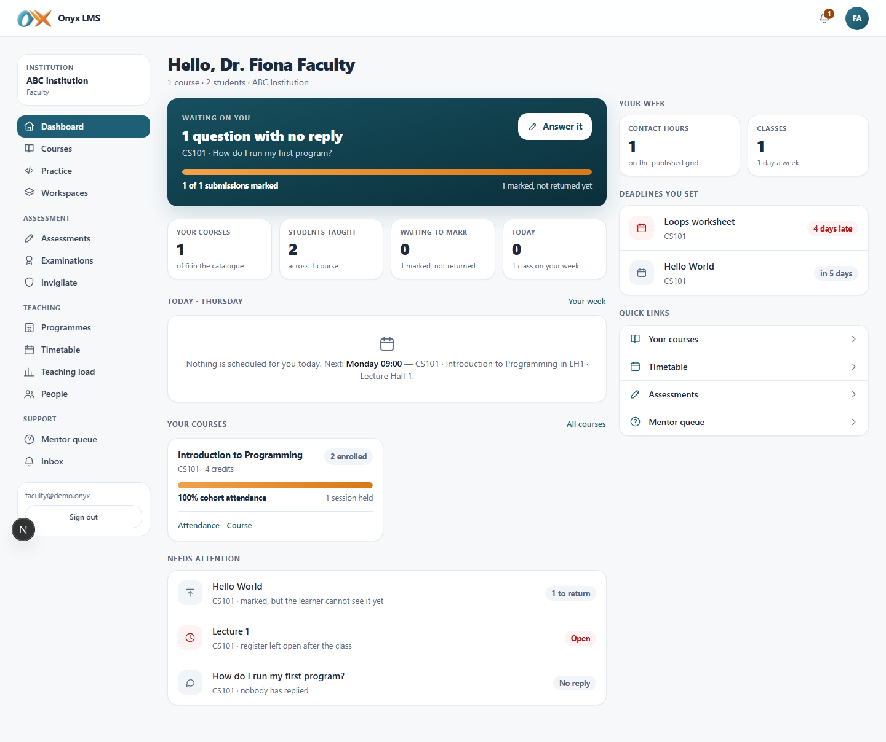

A teaching-day view, not the learner dashboard: today's classes, a marking
queue across every course taught, and a scan of recent activity on those
courses — built around "what needs me today," the same principle as the
student dashboard but for the other side of the room.

## Courses

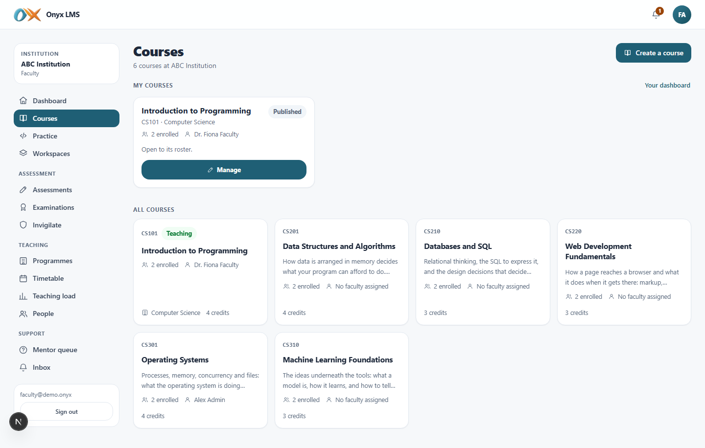

**My courses** (taught) and **All courses** (the institution's full
catalogue) as two separate sections — faculty can create a course of their
own here (auto-assigned as its teacher), not only teach ones an
administrator set up. Opening a taught course adds staff-only sections
invisible to a student: a settings/details form, a roster manager, **Set
work** (create an assignment), and attendance session creation with the
rotating check-in code and roster-marking screen.

## Practice

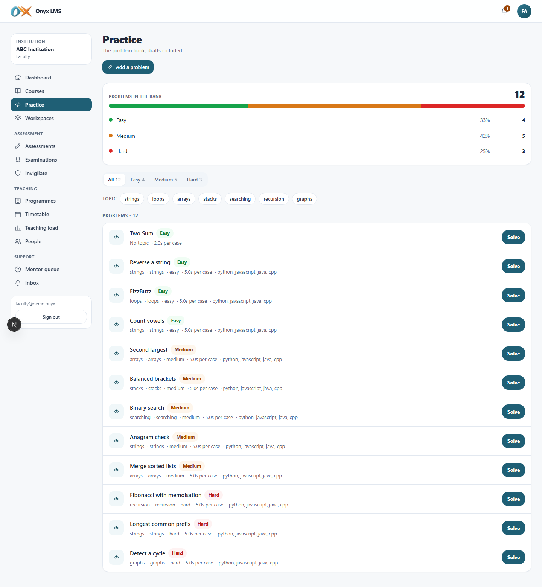

The same problem bank a student sees, plus a **New problem** panel and, on
each problem, a settings form and a test-case editor — visible and hidden
cases, points, and a publish/unpublish toggle so a mistake in the test cases
can actually be fixed rather than living forever once published.

## Workspaces

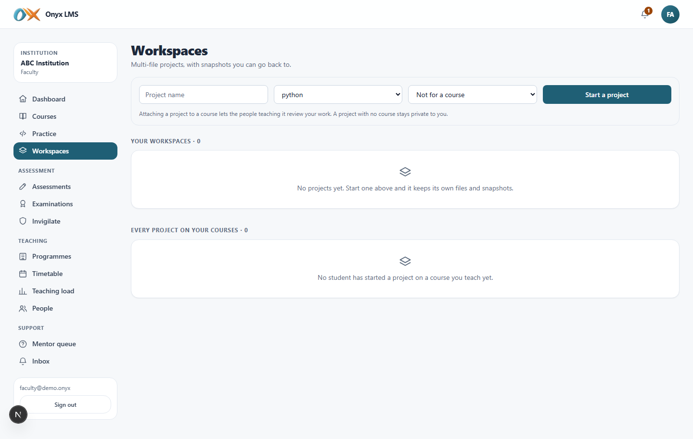

Every workspace across the courses this faculty member teaches (scoped —
not every workspace in the institution), so mentoring a student's project
does not require knowing its exact URL. Opening one as the reviewer gives
comments only: no edit, no snapshot, no restore, with the page saying so
plainly rather than silently refusing a click.

## Assessments

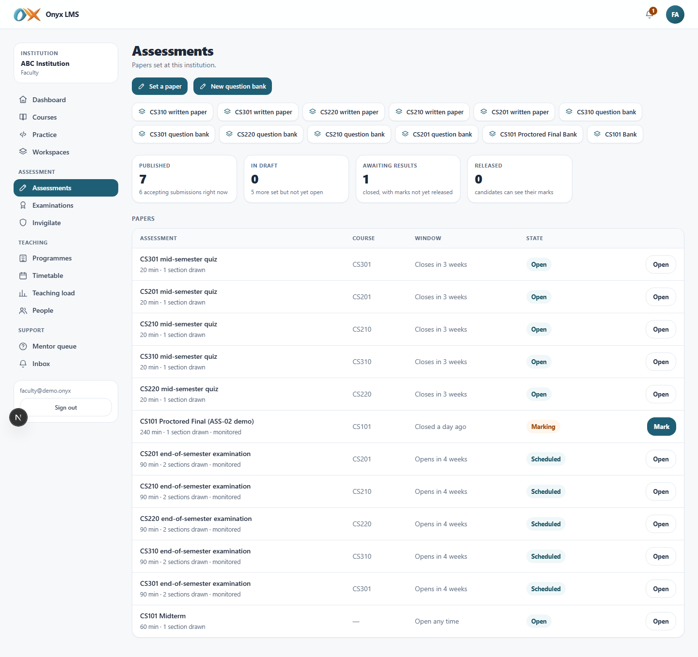

The question-bank builder, a **Build assessment** panel (sections drawn from
banks, proctoring toggles, pass marks), and a papers table with **Mark** and
**Results** actions once a paper closes. Marking screens never name an
anonymous candidate when the paper is set that way — the marker sees
"Candidate 1," never an email. Publishing results is the same course-scoped
trust as exams below: the assessment's own course faculty can release it
themselves.

## Examinations

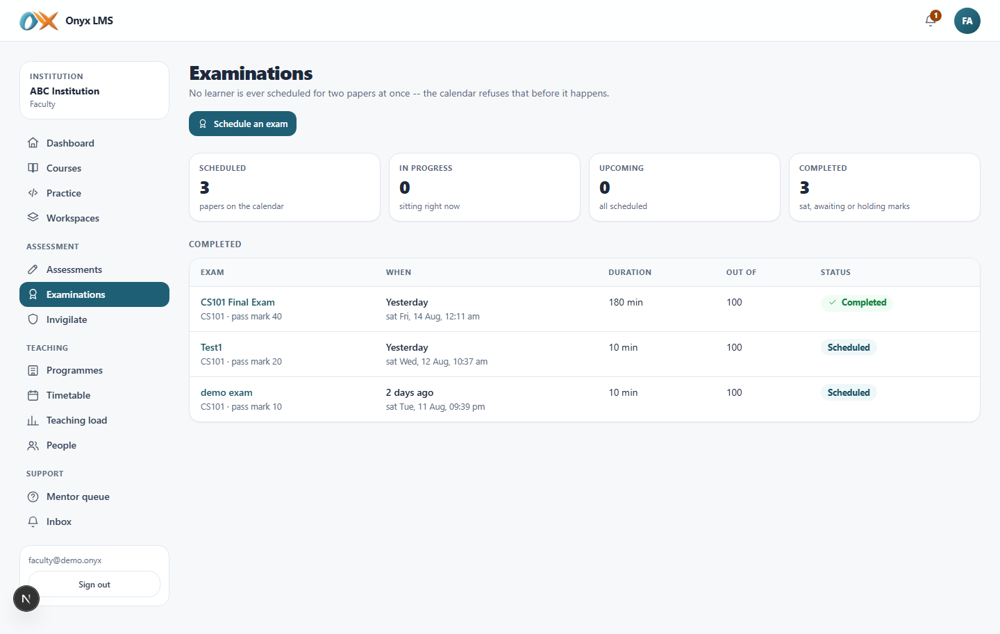

**New this session**: a faculty member can schedule an exam for a course
they teach — not only the examinations office. The **Schedule an exam**
panel offers only the courses this faculty member actually teaches, with an
optional **Online paper** picker to tie the exam to a CBT assessment on the
same course (its window is then locked to exactly the exam's scheduled
slot — a candidate cannot start it early or late, the whole difference
between an exam and an ordinary assessment).

Opening a scheduled exam gives editing, seat allocation *(seating stays
examinations-office-only — a shared physical resource)*, marks entry, a
**Pull marks from online paper** action (reads a CBT paper's graded scores
straight into the exam's own marks register), moderation, and **Publish
results** — the full lifecycle, end to end, for this exam's own course.

## Invigilate

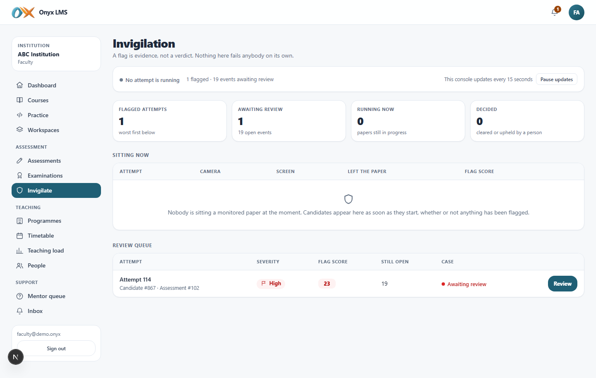

**Scoped to this faculty member's own courses** — a lecturer sees flags only
for candidates sitting a paper on a course they teach, never
institution-wide. Live: who is sitting right now and the state of their
required devices (camera, screen), a flag-severity review queue, and —
distinctly — a section for **examinations with flags**, so a proctored exam
sat online is never buried among ordinary assessments with just a generic
"assessment #N" label.

## Programmes

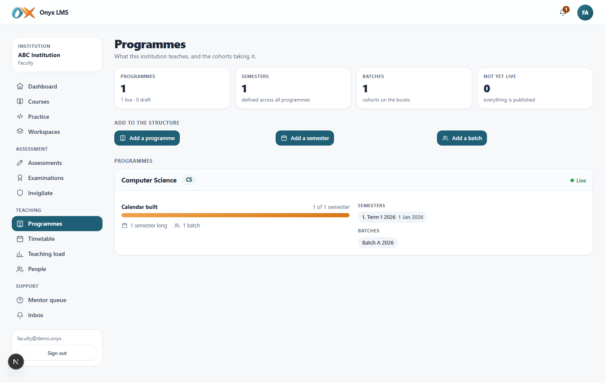

Read access to the institution's programme → semester → batch structure —
what a course sits inside — without the create/edit controls an
administrator has.

## Timetable

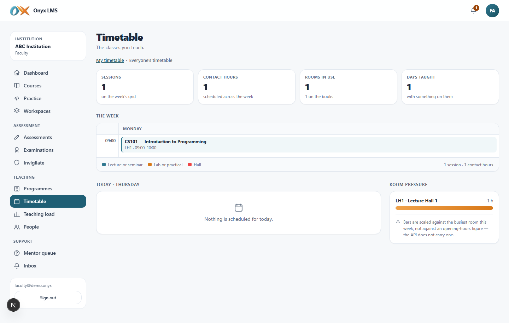

The same **My timetable / Everyone's timetable** view a student gets, so a
faculty member can see their own teaching slots and the wider room
schedule, but not create or edit one.

## Teaching load

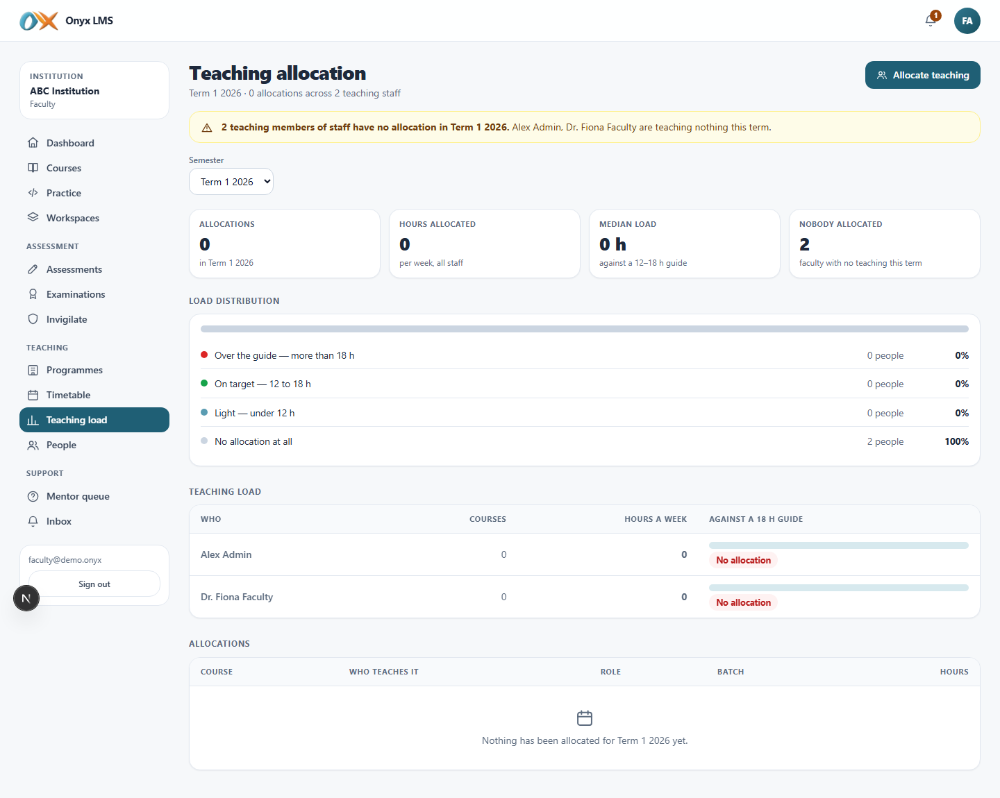

Read-only view of who teaches what and how many hours it carries this term
— the same page an administrator uses to allocate teaching, without the
allocate control.

## People

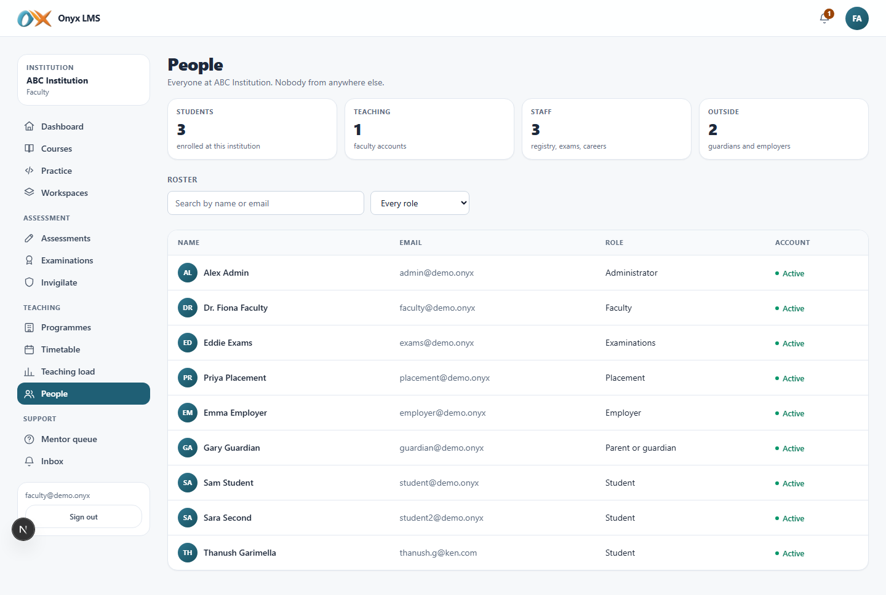

The roster for courses this faculty member teaches — names, roles, contact —
not the institution's whole membership register.

## Mentor queue

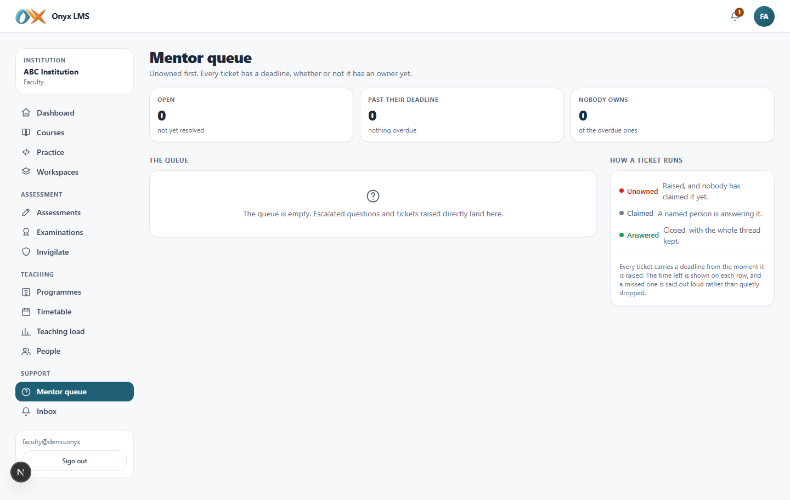

Support tickets escalated from course discussions: an SLA-breach banner,
unowned tickets surfaced first, and a **Claim** action. A learner's own
private ticket details stay visible to whoever owns it; the trail carries
staff-only notes a learner never sees.

## Inbox

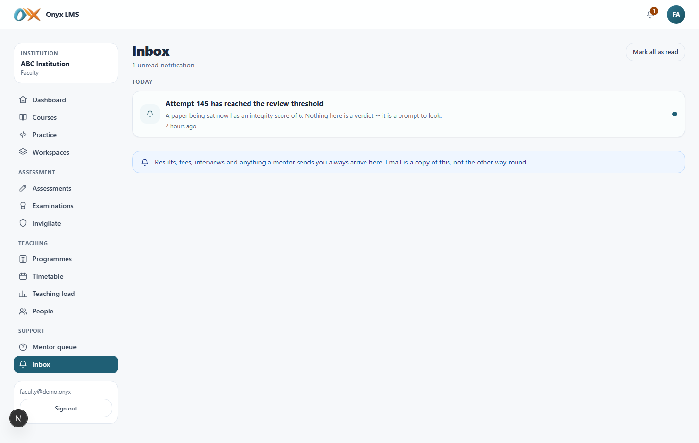

Ticket assignments, overdue SLA warnings, discussion mentions, and anything
else the system has generated for this account — the same one-way, read-only
notification centre every role gets.

---

## What changed this session

Faculty could previously only *enter marks* for an exam; scheduling,
editing, moderating and publishing were examinations-office-only. That is
now course-scoped: a faculty member can run the full lifecycle of an exam
on a course they teach, while seating (a shared physical resource) and
anything on a course they do *not* teach stay refused — enforced at the API,
not just hidden from the menu.

## What a faculty member cannot do

Cannot see or moderate another course's marks, cannot allocate halls or
seating, cannot see the institution-wide audit log or finance, and cannot
open a student's fee or attendance record outside a course they teach.
