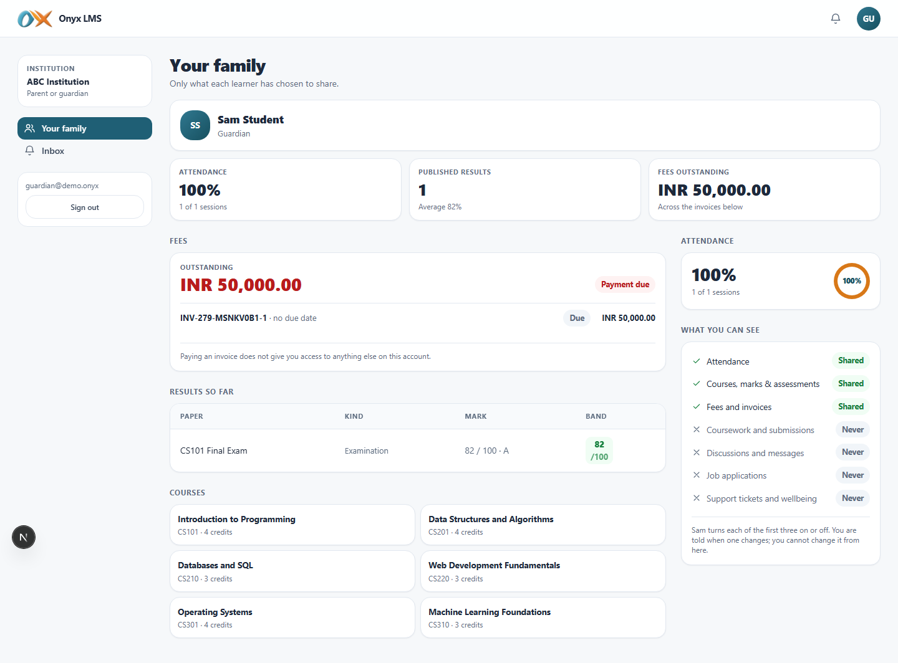
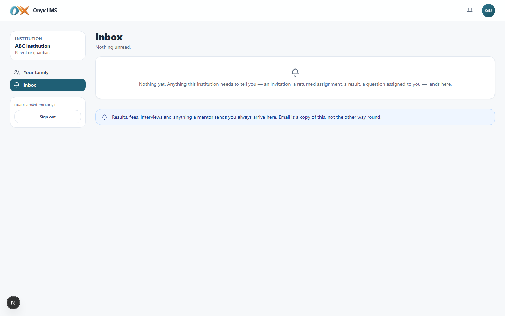

# Parent or guardian

DOC-05. What a parent or guardian sees and can do in Onyx. Screenshots are
from the demo institution (**ABC Institution**), captured live against a
running build.

## Who this is

Everything a guardian sees is derived from a link a learner controls, and
only what that learner has switched on. There is exactly one page — there
is nowhere else for this role to navigate to, because nothing here belongs
to the guardian; all of it is borrowed visibility into someone else's
account.

## Signing in

| | |
| --- | --- |
| URL | `/onyx/login` |
| Email | `guardian@demo.onyx` |
| Password | `Demo#2026!` |
| Institution | ABC Institution |

Signing in lands directly on **Your family** (`/onyx/family`).

## Navigation

| Group | Items |
| --- | --- |
| — | Your family, Inbox |

Phone bottom bar: Your family.

---

## Your family

One card per linked learner, then — for the selected learner — exactly
three panels, each present or absent according to what that learner has
switched on:

- **Attendance** — a percentage and a session count.
- **Fees** — the outstanding balance, invoices, and a due date. *Paying an
  invoice from here does not grant access to anything else on the
  account* — money and visibility are deliberately separate permissions.
- **Results** — published exam marks and assessment scores, with the grade
  band, exactly as the learner themselves would see them (never a mark
  still awaiting release).

A **What you can see** checklist on the page states plainly which of the
three are currently shared and which never will be (coursework,
discussions, job applications and support tickets are never shared with a
guardian, full stop) — and that the guardian is notified whenever the
learner changes what's shared, but cannot change it themselves.

## Inbox

The same one-way, read-only notification centre every role gets — the
learner accepting or withdrawing the link, and a consent change, are the
two events this account actually receives.

---

## What a guardian cannot do

Cannot see anything a learner has not explicitly shared, cannot see
coursework, submissions, discussions, job applications or support tickets
under any setting, cannot act on the learner's behalf (no submitting work,
no applying to jobs), and cannot see a second learner without that
learner's own separate link and consent.
