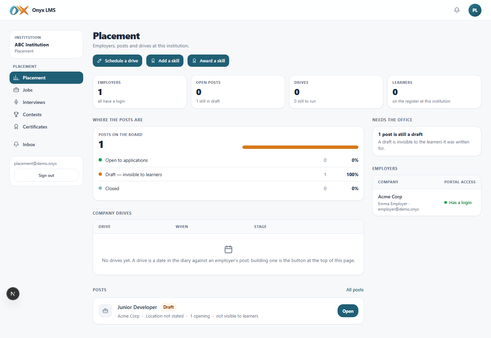
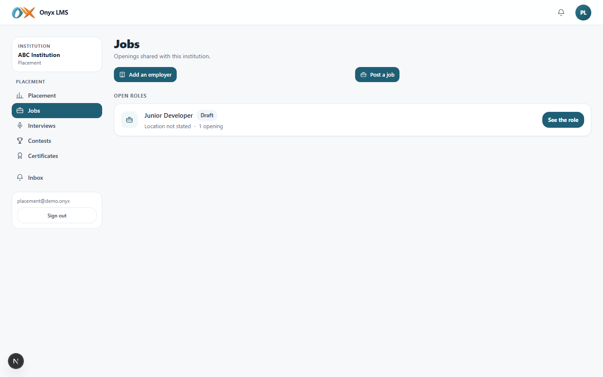
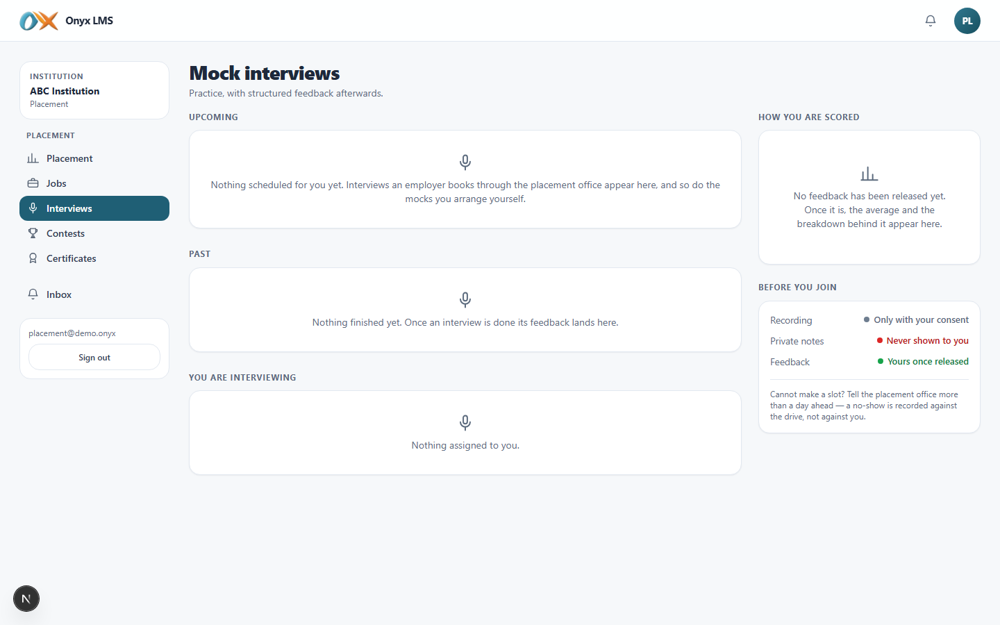
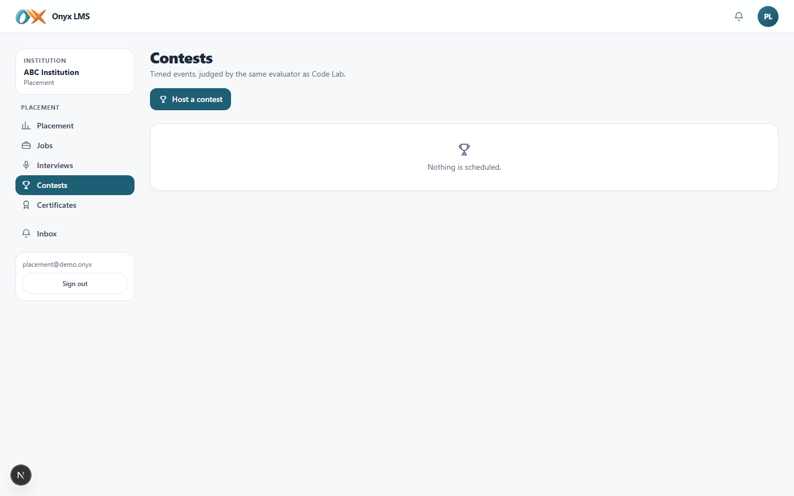
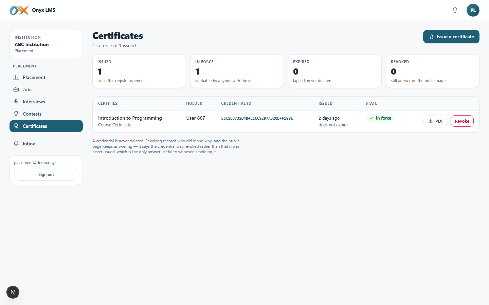
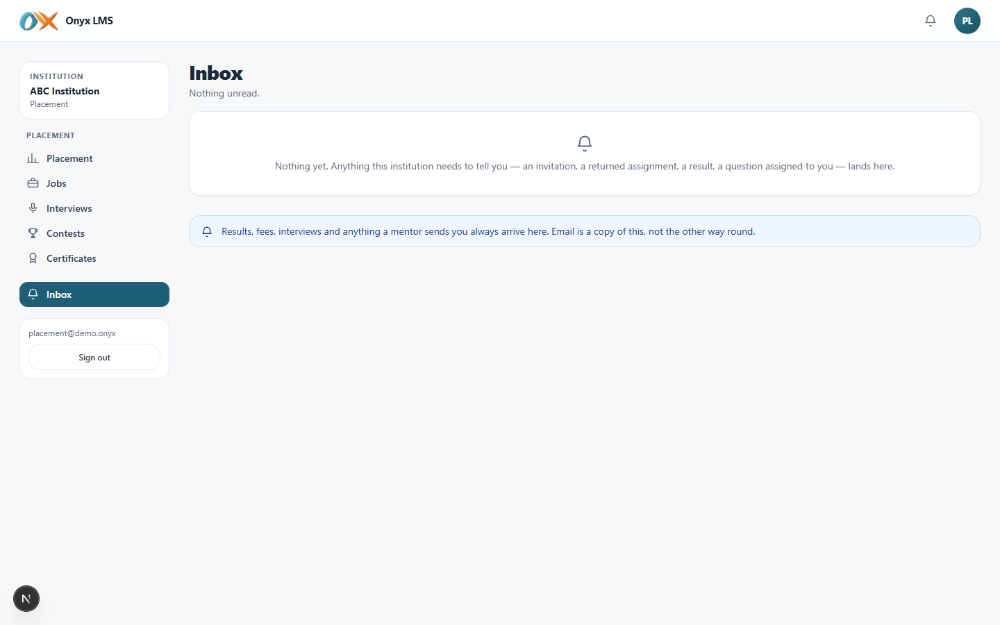

# Placement

DOC-05. What the placement role sees and can do in Onyx, screen by screen,
with what each one actually looks like. Screenshots are from the demo
institution (**ABC Institution**), captured live against a running build.

## Who this is

Owns the institution's employer relationships: job posts, applications,
shortlisting, drives, and everything career-facing — hackathons/contests,
mock interviews, and skill certificates. Like the examinations role, has no
course of its own, so Courses/Practice/Workspaces are absent from the menu.

## Signing in

| | |
| --- | --- |
| URL | `/onyx/login` |
| Email | `placement@demo.onyx` |
| Password | `Demo#2026!` |
| Institution | ABC Institution |

Signing in lands directly on **Placement** (`/onyx/placement`) — no
dashboard stop first.

## Navigation

| Group | Items |
| --- | --- |
| Placement | Placement, Jobs, Interviews, Contests, Certificates |
| — | Inbox |

Phone bottom bar: Placement, Jobs, Interviews, Contests, Inbox.

---

## Placement

The placement office's own hub: the employer register (who is allowed to
post, and what the institution has shared with them), drives and their
rounds, and outcomes — reconciled against the offers actually recorded,
so a drive's numbers cannot silently drift from what employers reported.

## Jobs

Every job post across every employer at this institution, with the same
eligibility-rule machinery a student sees, but from the placement office's
side: who can apply, who has, and where each application sits in its
pipeline (Applied → Shortlisted → Interviewed → Decision).

## Interviews

Every scheduled mock or placement interview, with structured, per-criterion
feedback and an optional recording. A learner only ever sees feedback once
it is released — this is where it's entered and released from.

## Contests

Host a hackathon or contest: timed, with team formation, a live leaderboard
(rank, solved, points, penalty, freeze window near the end) and structured
judging — the same page a student watches from the other side.

## Certificates

Issue and revoke verifiable credentials, identical to the examinations
office's own certificate register — either role can issue one, since a
"Placement Ready" or "Hackathon Winner" credential is exactly as much this
office's business as an academic one is the examinations office's.

## Inbox

The same one-way, read-only notification centre every role gets.

---

## What the placement role cannot do

Cannot teach, mark or enter exam results, cannot see fees or the
institution's finances, cannot manage people or academic structure, and
cannot reach the platform console.
