# Student

DOC-05. What a student sees and can do in Onyx, screen by screen, with what
each one actually looks like. Screenshots are from the demo institution
(**ABC Institution**), captured live against a running build.

## Who this is

Takes courses, sits assessments and examinations, practises in the Code Lab,
tracks their own attendance and fees, and builds a job-ready profile. Sees
only their own work — never another learner's.

## Signing in

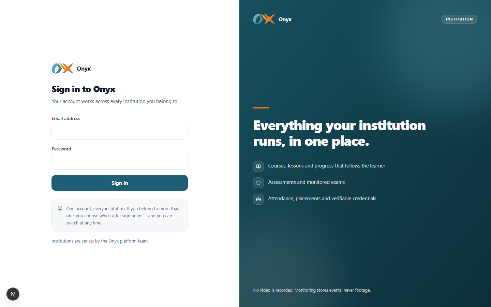

| | |
| --- | --- |
| URL | `/onyx/login` |
| Email | `student@demo.onyx` |
| Password | `Demo#2026!` |
| Institution | ABC Institution |

The same form serves every tenant role; which account you type in decides
where you land. A student lands on their **Dashboard**.

## Navigation

| Group | Items |
| --- | --- |
| — | Dashboard, Courses, Practice, Workspaces |
| Assessment | Assessments, Examinations, Results, Contests |
| Campus | Timetable, Fees, Help |
| Career | Jobs, Interviews, Your profile |
| — | Inbox |

Phone bottom bar (five max): Dashboard, Courses, Practice, Results, Timetable.

---

## Dashboard

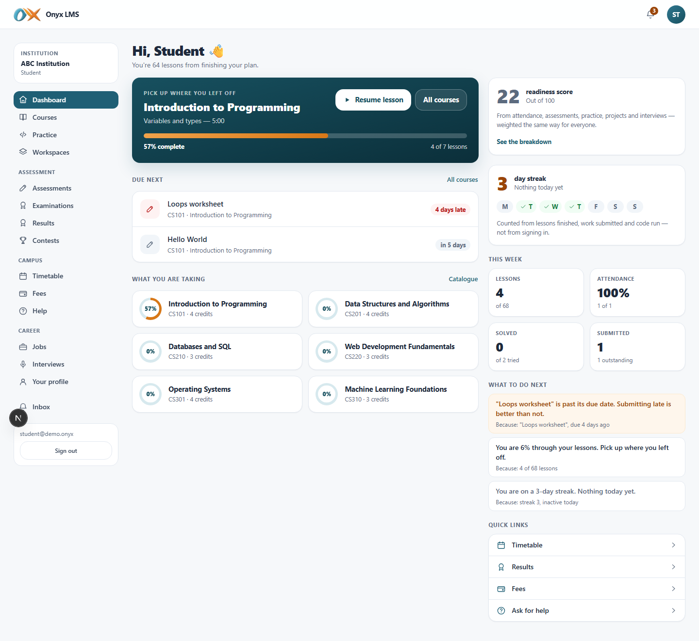

The one screen ordered around "what do I do next," not a wall of counters:

- **Pick up where you left off** — the most recently-touched course, resuming
  on the exact lesson and timestamp, not just the course itself.
- **Due next** — up to five assignments across every enrolled course, latest
  and most-overdue first, including work already late.
- **What you are taking** — every enrolled course as a card with its own real
  progress ring (not a platform-wide average smeared across every course).
- **Readiness score** — out of 100, the same five-part formula (attendance,
  assessments, practice, projects, interviews) every learner is scored by,
  with a link through to the full breakdown on **Your profile**.
- **Day streak** — counted from lessons finished, work submitted and code
  run, never from merely signing in.
- **This week** — lessons completed, attendance %, practice problems solved,
  assignments submitted.
- **What to do next** — up to four computed nudges, each stating the signal
  behind it ("because…") rather than a bare instruction.
- **Attendance needs attention** — only shown when a course has dropped below
  the attendance threshold, with the class average alongside your own figure.
- **Quick links** to Timetable, Results, Fees and Help.

## Courses

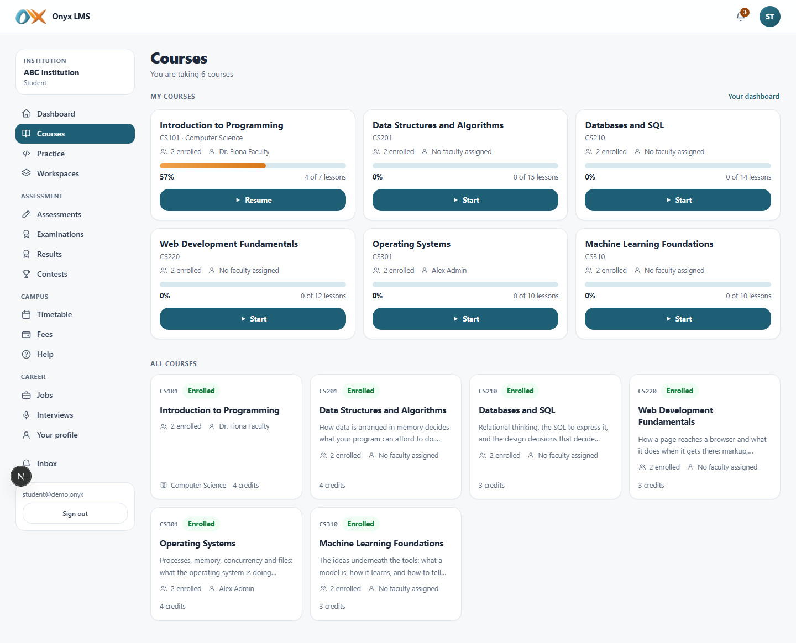

Two sections, always both present: **My courses** (enrolled, with a progress
ring and a Resume/Start button) and **All courses** (the full catalogue,
with a **Join this course** button wherever self-enrolment is switched on —
otherwise a note that enrolment is handled by the programme office).

Opening a course shows the numbered modules with each lesson's state
(done / next / locked), a "Questions" section for course Q&A, upcoming
sessions, due work and downloadable resources. A lesson video resumes
exactly where you left it; a locked lesson still shows its title, just not
its content, so the shape of the course is never hidden.

## Practice

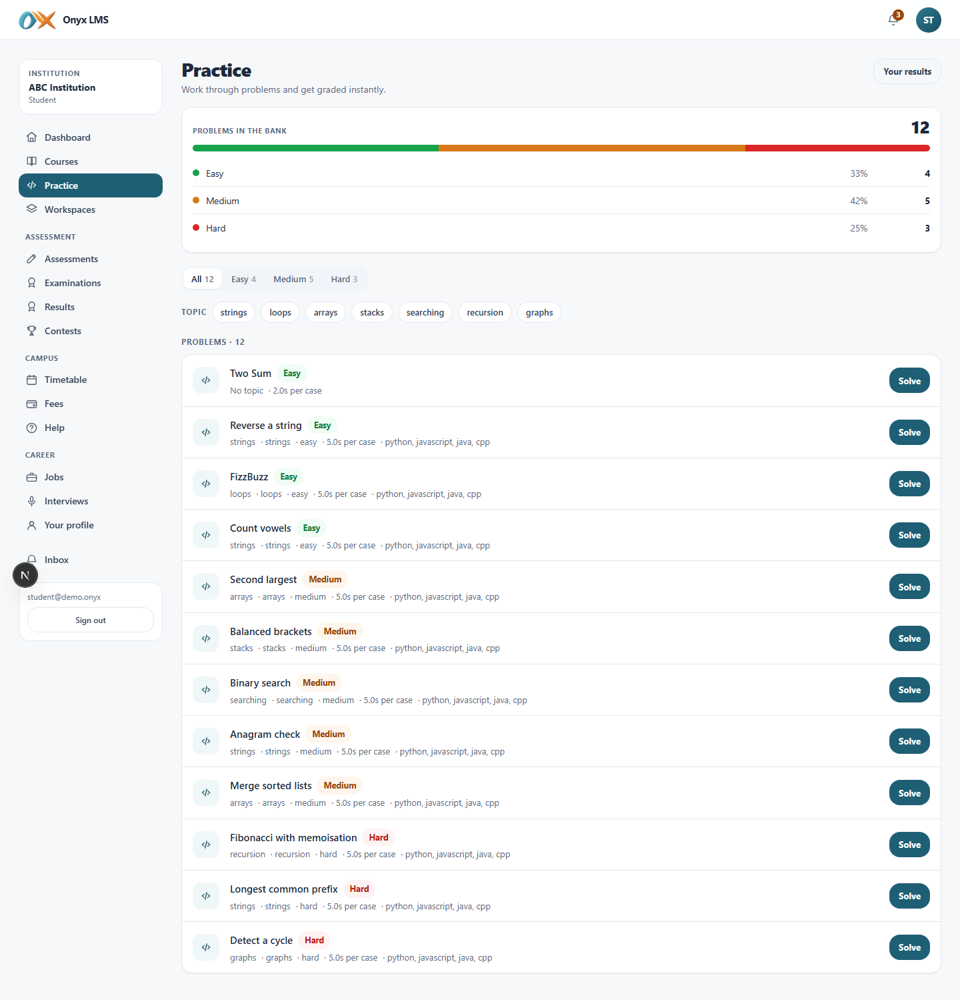

The Code Lab's problem bank: difficulty and topic filters, a difficulty
breakdown, and a list of problems with a **Solve** action. Opening a problem
gives the statement, constraints, visible sample cases (hidden cases are
named but never shown), a real in-browser editor with run/submit controls,
and a hint-reveal button that costs a stated amount and shows one hint at a
time. A worked solution appears once its release rule is met — never before.

## Workspaces

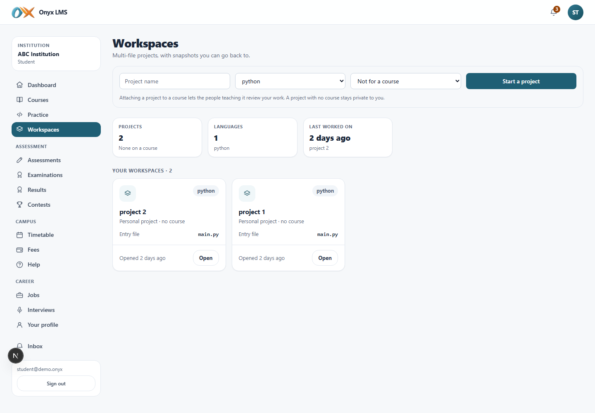

Multi-file coding projects that go beyond a single practice problem: a file
tree, an editor, run controls, and a **Take a snapshot** button that captures
the whole tree at a point in time so earlier states are never lost. A
project can be opened for review by the faculty member teaching that course,
who can comment but never edit or restore a snapshot.

## Assessments

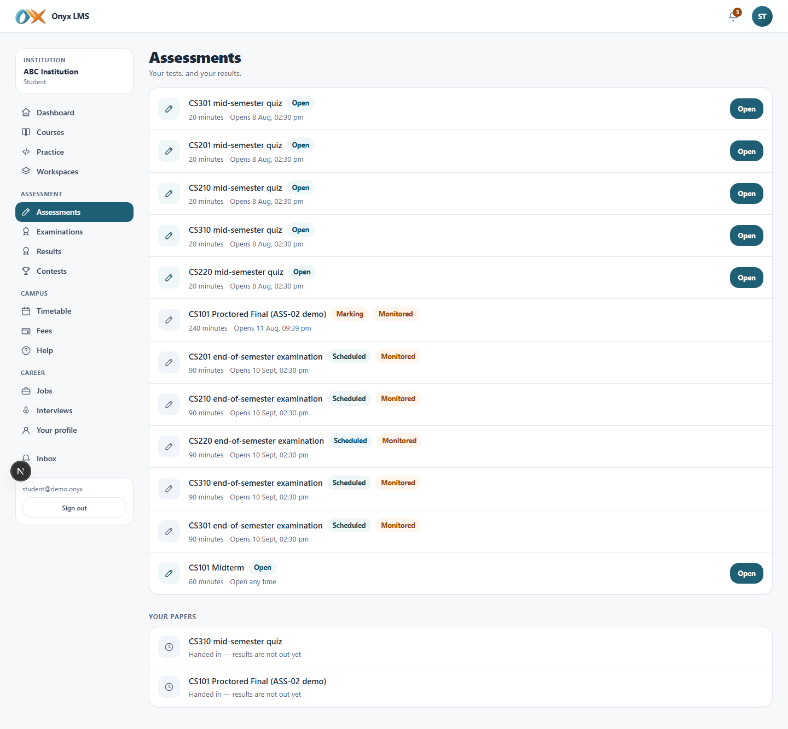

Every assessment you can sit or have sat, as a plain list: **Open** while its
window is live, greyed out before it opens or after it closes, with your own
attempt history and score once results are released. Opening one still
inside its window shows a consent screen naming exactly what proctoring
requires — camera, screen, tab-switch detection — before anything about the
paper is dealt to the browser. Once started: a server-authoritative timer,
autosave on every answer, and (for subjective questions) marking that stays
invisible until the whole paper is released.

## Examinations

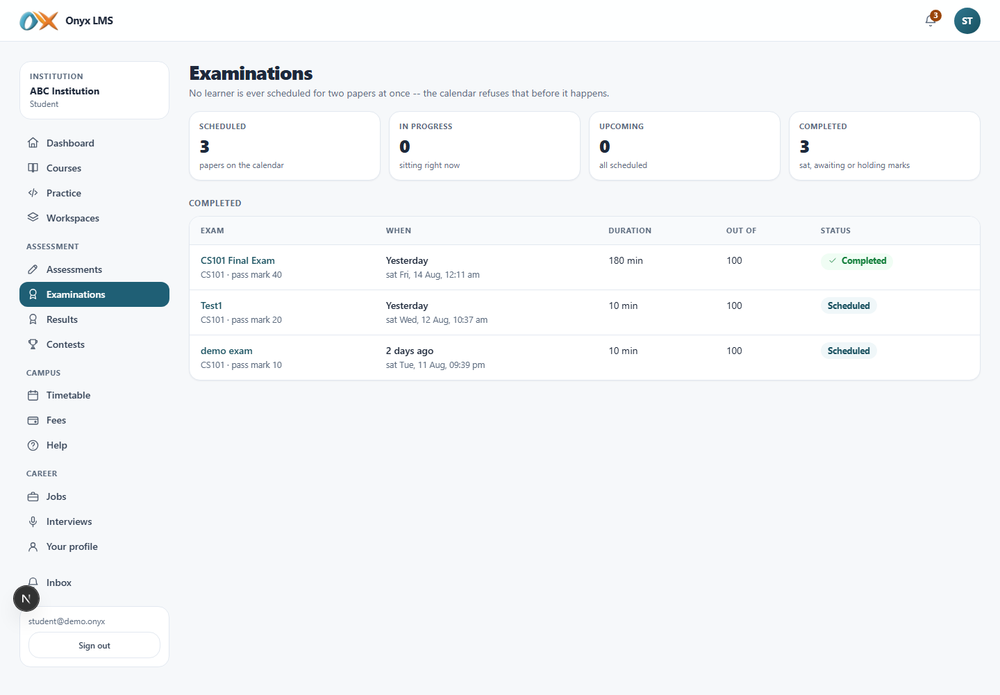

The exam calendar — In progress, Upcoming, Completed and Cancelled — with no
management actions, just what is scheduled and when. Opening a scheduled
exam shows your seat (once seating is published) and, for an exam sat
online through the CBT engine, an **Online paper** card: "Sit this exam"
only appears inside the exact scheduled window — unlike an ordinary
assessment, it cannot be started early or late. Once your mark is published
(by the examinations office or the course's own faculty), a **Your result**
card appears on this same page — the score, the grade, and whether you
passed — not just on the separate Results page.

## Results

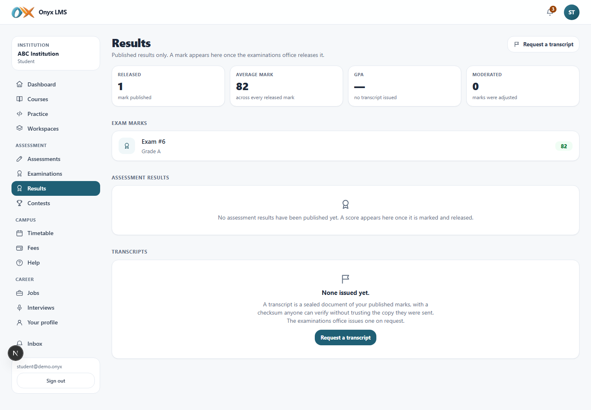

Every mark that has actually been released to you, in one place: **Exam
marks** (from the examinations office) and **Assessment results** (from
faculty-marked coursework and Code Lab evaluations) as two separate
sections, plus a summary (marks released, average, GPA, how many were
moderated) and your issued **Transcripts**, each a sealed document with a
checksum anyone can verify without trusting the copy you send them. A
transcript is requested here (via Help) — it is issued by the examinations
office, not self-served.

## Contests

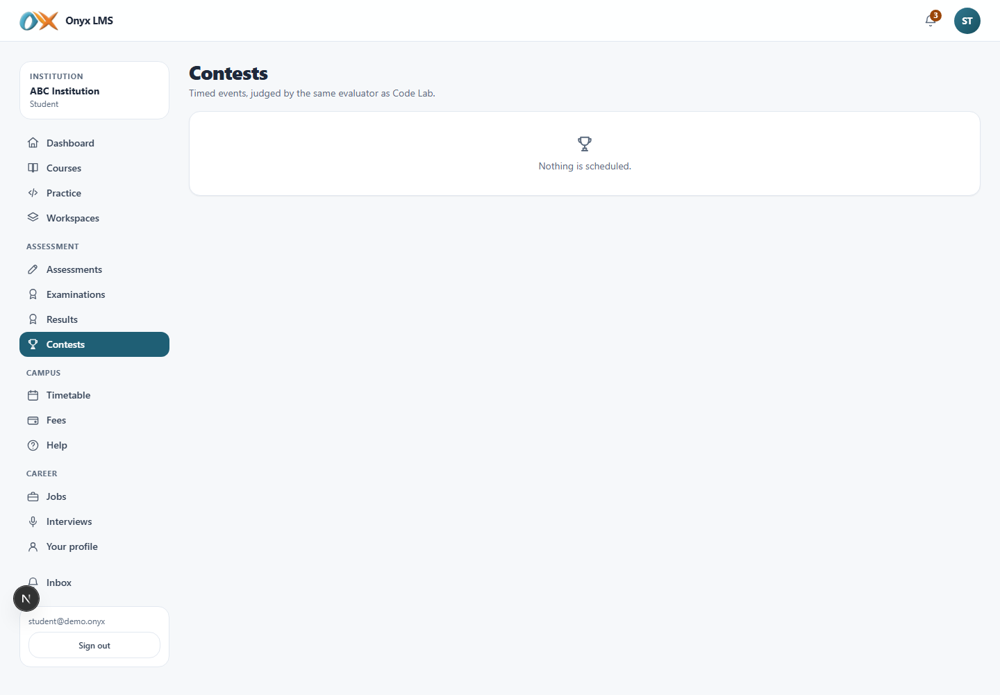

Live, Upcoming and Past contests. A live contest shows a countdown, its
problem set (each linking straight into Practice), and a full leaderboard —
rank, solved count, points, penalty minutes, with your own row highlighted
and a freeze-window banner near the end so standings don't spoil the finish.
You can form or join a team from here when a contest allows it.

## Timetable

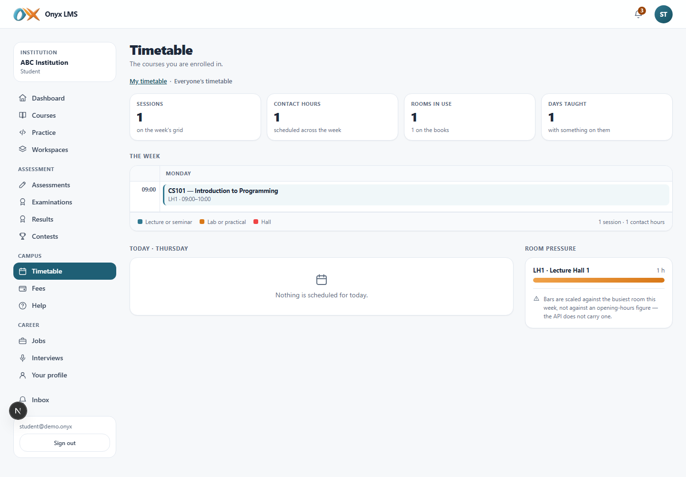

A **My timetable / Everyone's timetable** toggle over a colour-coded week
grid, room-pressure meters, and a **Today** list. Nothing appears here until
the registrar publishes the semester's timetable.

## Fees

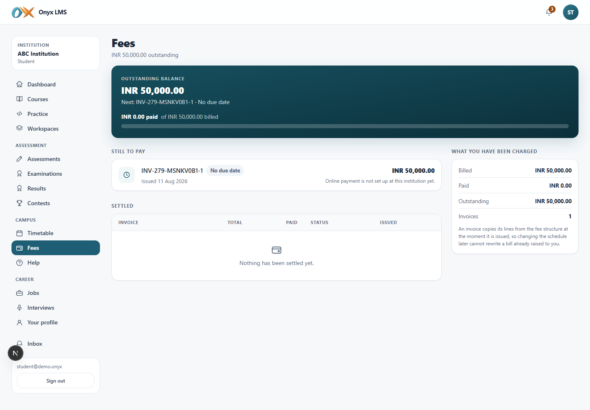

Fully self-service: an outstanding-balance hero with a paid/billed meter, an
overdue banner where relevant, a **Still to pay** list with a **Pay** button
that opens the configured payment gateway, and a **Settled** table of what's
already cleared. A confirmation banner appears after returning from the
gateway.

## Help

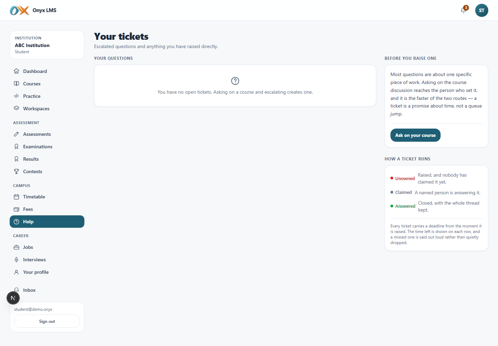

Your own support tickets — status, priority, an SLA countdown — plus a
steer toward asking on the course's own discussion thread first, since most
questions belong there rather than in a ticket. A thread can be escalated to
a ticket if it goes unanswered; a mentor then owns it and you're notified in
your Inbox when it's answered.

## Jobs

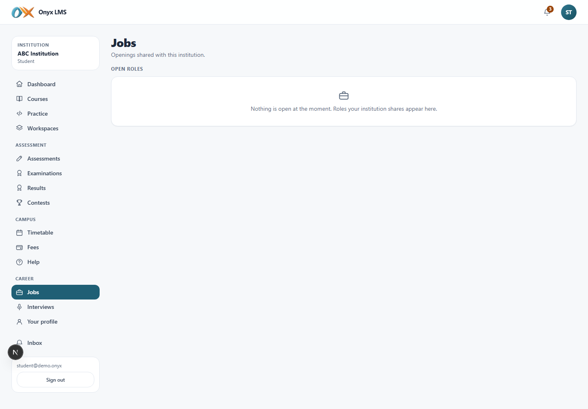

An eligibility banner ("N of M roles match your record"), a list of open
roles with Applied/Eligible/Rule-count chips, and **Your applications**
pipeline. Opening a role shows exactly which eligibility rules you meet and
which you don't, an **Apply** button once you qualify, and a stepper
(Applied → Shortlisted → Interviewed → Decision) once you have.

## Interviews

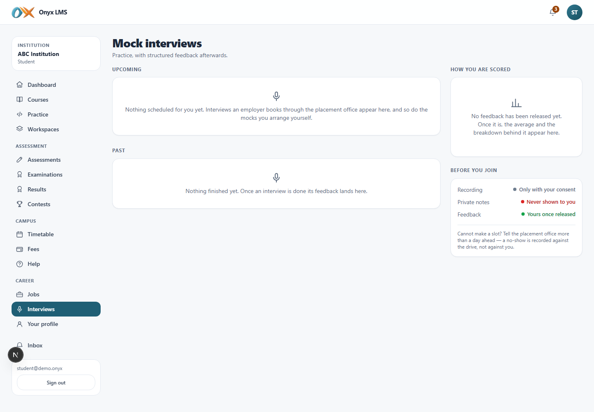

Your next interview up top (a join link, or a note that it's in person),
then Upcoming and Past lists, and a **How you are scored** panel — your
average and a per-criterion breakdown, computed only from feedback that has
actually been released to you. Opening a past interview shows the released
score, per-criterion comments, and a note about recording consent where one
was made.

## Your profile

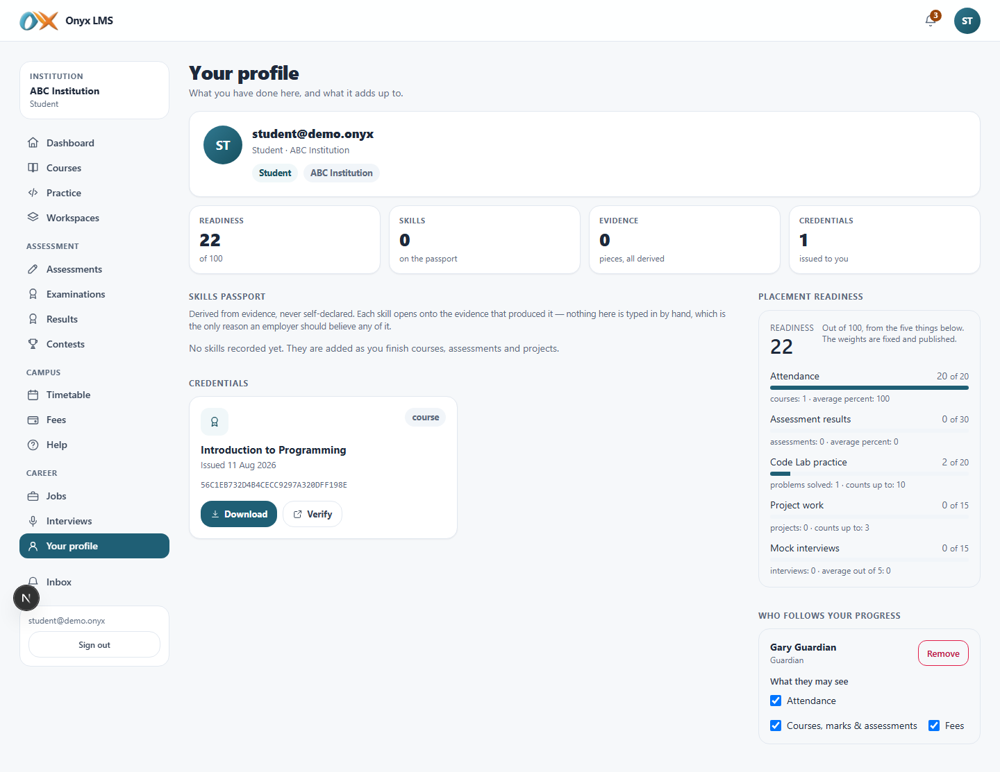

Your identity card, four stat tiles (readiness, skills, evidence pieces,
credentials), a **Skills passport** where every entry traces back to real
evidence (never self-declared), a **Credentials** grid (download the PDF,
or open the public verification link, for each certificate you hold), a
**Placement readiness** breakdown, and — student-only — **Who follows your
progress**: accept or withdraw a guardian's link, and control exactly what
each guardian can see (attendance, results, fees — each switched on or off
independently).

## Inbox

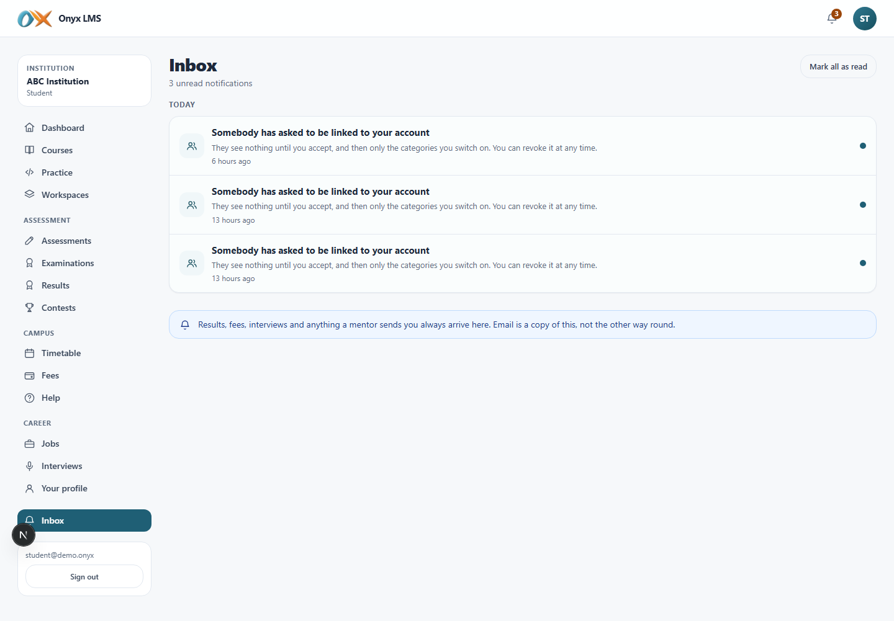

Everything the system has told you, grouped Today / This week / Earlier —
ticket updates, returned work, published results, a certificate being
issued, a guardian link changing, an @mention in a discussion. One-way only:
a student cannot message anyone through this screen, only read what has
been sent to them. **Mark all read** clears the header badge.

---

## What a student cannot do

No course management, no marking anyone else's work, no seeing another
learner's attendance or attempts, no seating plans (only their own seat), no
publishing results, no institution-wide reports, and no Invigilate console —
a direct link to `/onyx/invigilate` is refused with a redirect, not merely
hidden from the menu.
